# AWS-StepFunction-Implementation


# 📌 Practical 7: Workflow Implementation using AWS Step Functions

## 👨‍🎓 Student Details

* **Name:** Ketan Sonawane
* **PRN:** 202301040161
* **Batch:** CCF2

---

# 🎯 Objective

To implement a workflow using AWS Step Functions that executes an Amazon Athena query on data stored in Amazon S3 and stores the results back in S3 with proper error handling and retry mechanism.

---

# 🧰 Services Used

* Amazon S3 (Storage)
* Amazon Athena (Query Engine)
* AWS Step Functions (Workflow Orchestration)

---

# 🏗️ Architecture Overview

S3 (Input Data) → Athena (Query Execution) → Step Functions (Workflow Control) → S3 (Output Results)

---

# 📂 Step 1: Create S3 Buckets

## 1. Input Bucket

* Service: Amazon S3
* Bucket Name: `athena-input-data-practical-7`
* Upload CSV file (`athena_employee_data.csv`)

  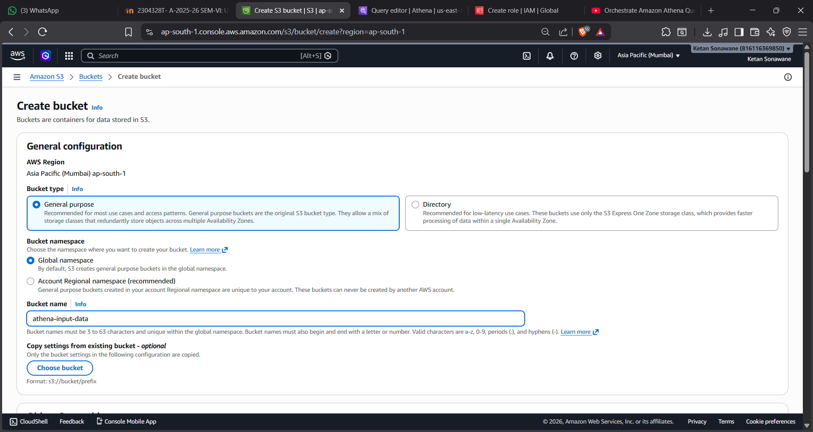
  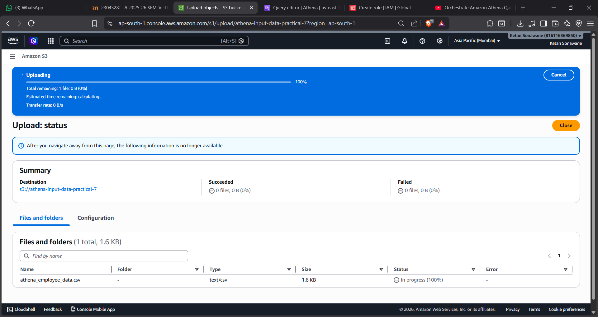

## 2. Output Bucket

* Bucket Name: `athena-output-data`
* Used to store Athena query results

  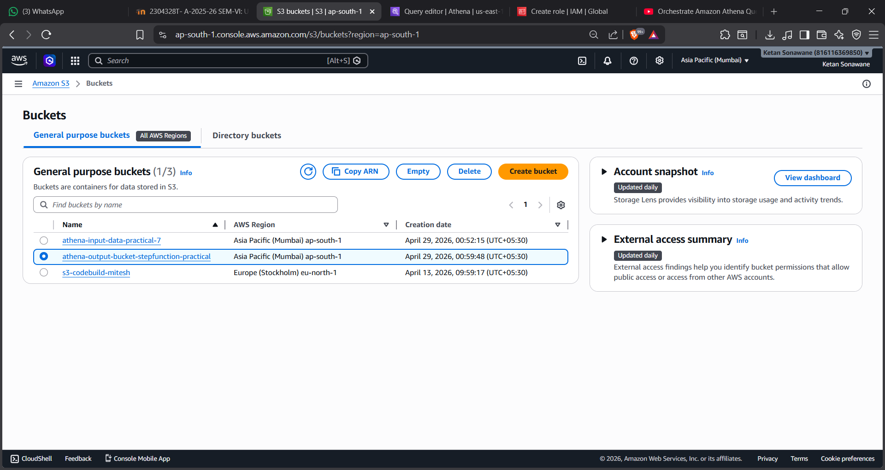

---

# 📊 Step 2: Prepare Dataset

CSV file structure:

id,name,department,date
1,John,IT,2024-01-01
2,Alice,HR,2024-01-02

(50+ rows used in actual implementation)

---

# 🧱 Step 3: Create Athena Database

```sql
CREATE DATABASE stepfunction_db;
```
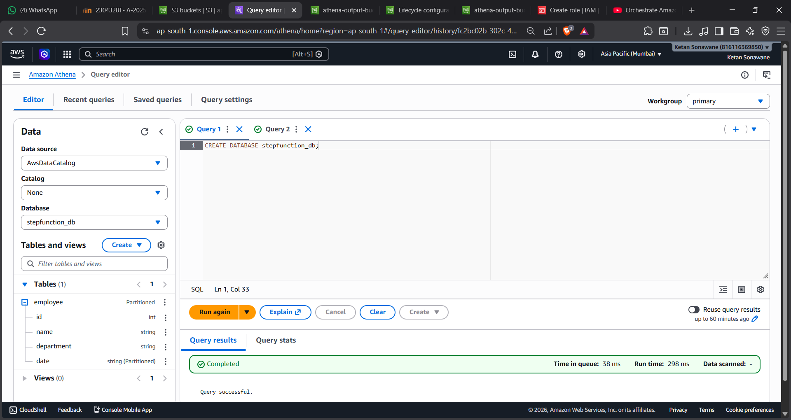
---

# 🏗️ Step 4: Create Athena Table

```sql
CREATE EXTERNAL TABLE stepfunction_db.employee (
  id INT,
  name STRING,
  department STRING,
  date STRING
)
ROW FORMAT DELIMITED
FIELDS TERMINATED BY ','
STORED AS TEXTFILE
LOCATION 's3://athena-input-data-practical-7/';
```
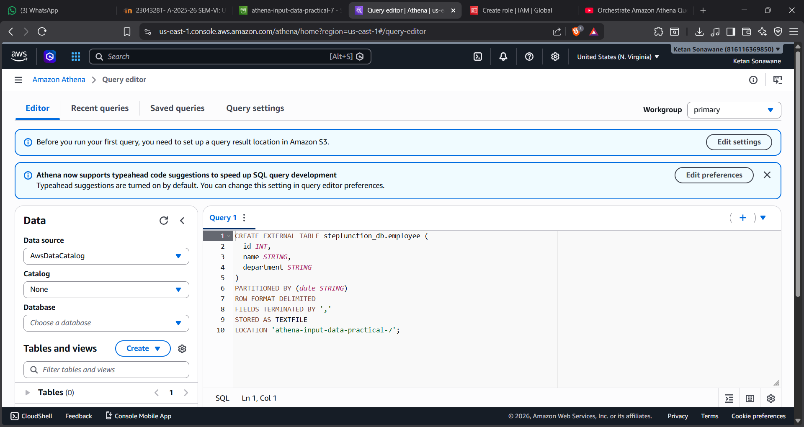
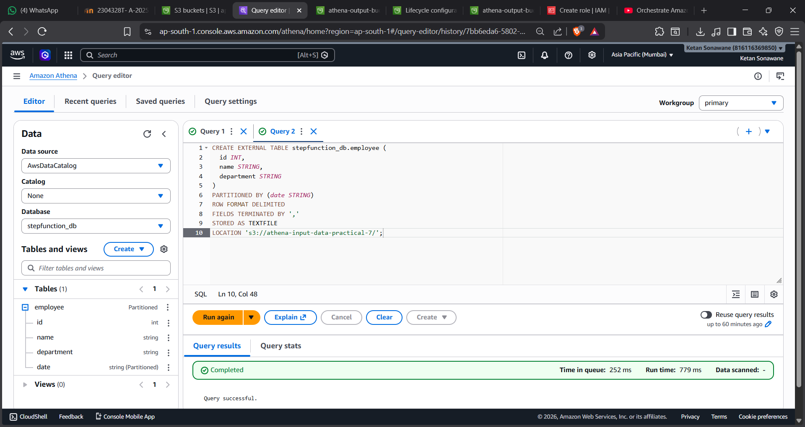
---

# 🔍 Step 5: Query the Data

```sql
SELECT * FROM stepfunction_db.employee LIMIT 10;
```
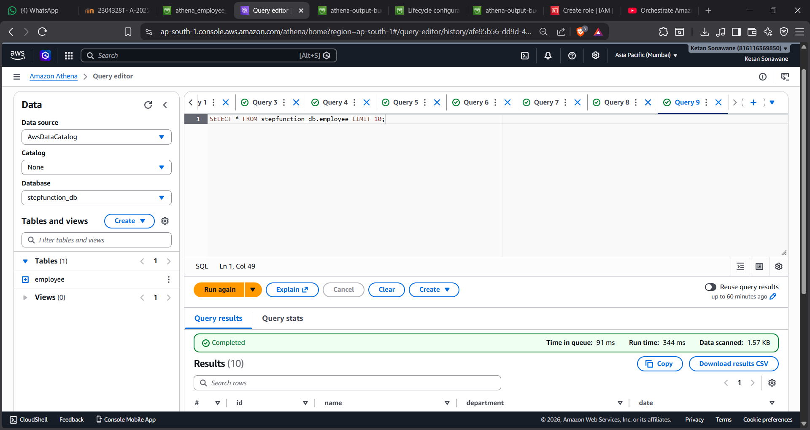

---

# ⚙️ Step 6: Configure Query Result Location

* Navigate to Athena Settings
* Set Output Location:

s3://athena-output-data/

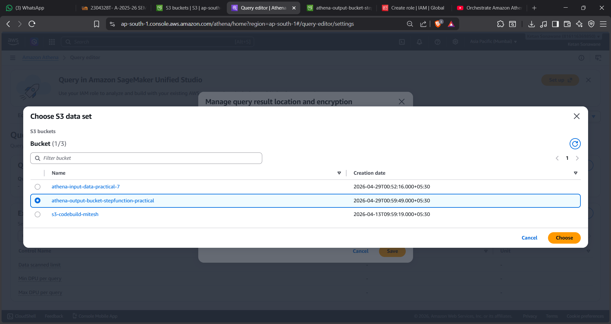

---

# 🔄 Step 7: Create Step Function

* Service: AWS Step Functions
* Type: Standard Workflow
* Mode: Write workflow in code

  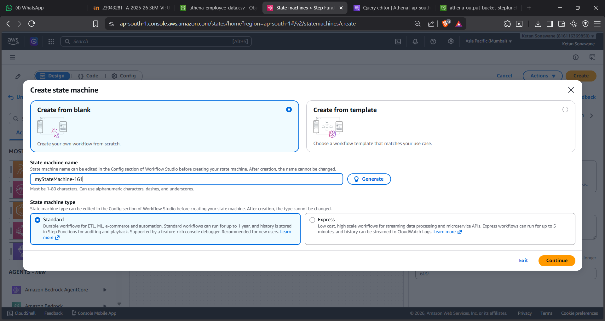
  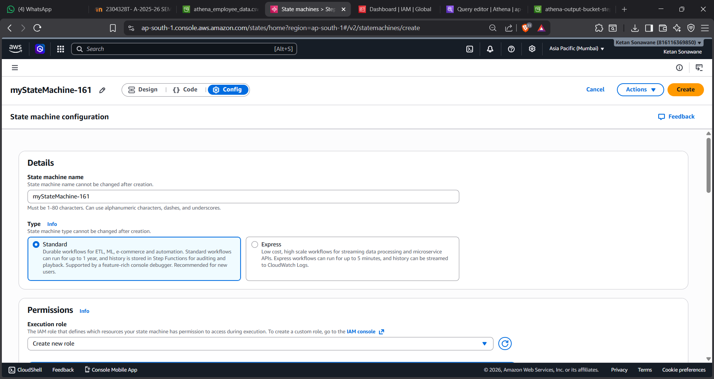
  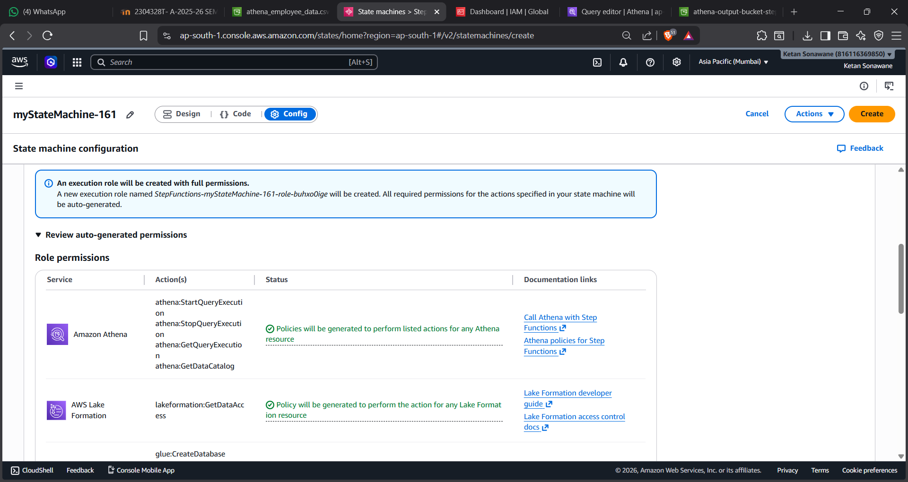
  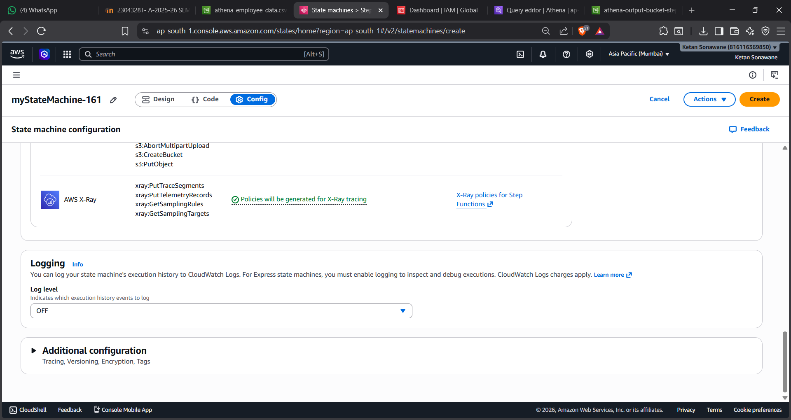

---

# ⚡ Step 8: Workflow Definition (JSON)

```json
{
  "StartAt": "RunAthenaQuery",
  "States": {
    "RunAthenaQuery": {
      "Type": "Task",
      "Resource": "arn:aws:states:::athena:startQueryExecution.sync",
      "Parameters": {
        "QueryString": "SELECT * FROM stepfunction_db.employee;",
        "ResultConfiguration": {
          "OutputLocation": "s3://athena-output-data/"
        }
      },
      "Retry": [
        {
          "ErrorEquals": ["Athena.AmazonAthenaException"],
          "IntervalSeconds": 2,
          "MaxAttempts": 3,
          "BackoffRate": 2.0
        }
      ],
      "Catch": [
        {
          "ErrorEquals": ["States.ALL"],
          "Next": "FailState"
        }
      ],
      "End": true
    },
    "FailState": {
      "Type": "Fail",
      "Cause": "Query Failed"
    }
  }
}
```
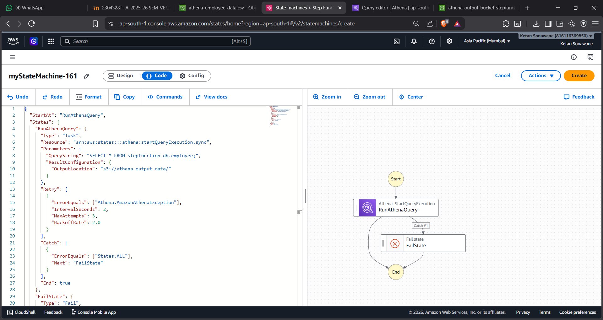

---

# ▶️ Step 9: Execute Workflow

* Click **Start Execution**
* Monitor workflow execution
* Status: **Succeeded**

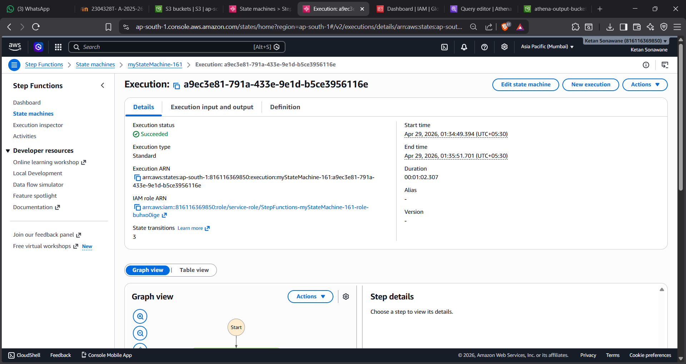
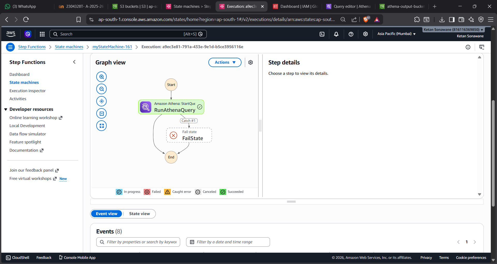
---

# 📂 Step 10: Verify Output

* Go to S3 output bucket
* Path: `s3://athena-output-data/`
* Query results stored as CSV file

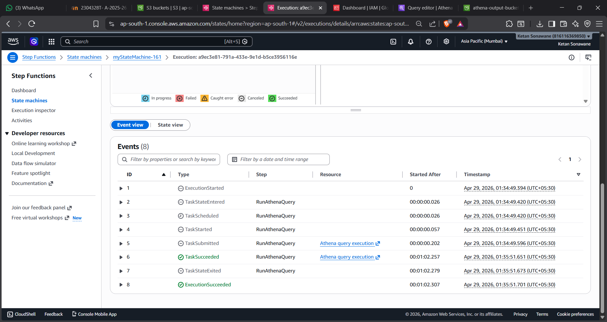
---

# ⚠️ Error Handling & Retry

* Retry configured for:

  * Athena.AmazonAthenaException
* Automatic retries:

  * Max Attempts: 3
  * Backoff Rate: 2.0

---

# 🧠 Key Concepts

## 🔹 Step Functions

Used to automate and orchestrate AWS services.

## 🔹 Athena

Used to run SQL queries directly on S3 data.

## 🔹 S3

Used as storage for input and output data.

## 🔹 .sync Pattern

Ensures workflow waits until query execution is complete.

---

# ✅ Conclusion

Successfully implemented a workflow using AWS Step Functions to execute Athena queries on S3 data with proper error handling and result storage.

---
